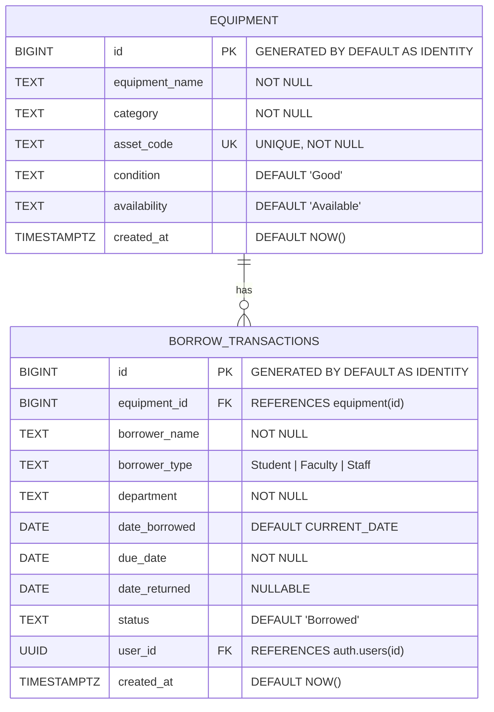

# Entity Relationship Diagram (ERD)

**System:** Equipment Borrowing and Return Monitoring System  
**Database:** Supabase PostgreSQL  

---

## 1. Mermaid Entity Relationship Diagram

---

## 2. Table Data Dictionaries

### Table: `equipment`
| Column Name | Data Type | Constraints | Description |
| :--- | :--- | :--- | :--- |
| `id` | `BIGINT` | PRIMARY KEY, IDENTITY | Unique surrogate key for equipment item. |
| `equipment_name` | `TEXT` | NOT NULL | Human-readable name of the equipment. |
| `category` | `TEXT` | NOT NULL | Category classification (e.g., Projector, Laptop, Camera). |
| `asset_code` | `TEXT` | UNIQUE, NOT NULL | School barcode / asset tag identifier. |
| `condition` | `TEXT` | DEFAULT 'Good' | Physical condition ('Good', 'Fair', 'Needs Repair', 'Damaged'). |
| `availability` | `TEXT` | DEFAULT 'Available' | Availability state ('Available', 'Borrowed', 'Under Maintenance'). |
| `created_at` | `TIMESTAMPTZ` | DEFAULT NOW() | Timestamp when record was created. |

---

### Table: `borrow_transactions`
| Column Name | Data Type | Constraints | Description |
| :--- | :--- | :--- | :--- |
| `id` | `BIGINT` | PRIMARY KEY, IDENTITY | Unique surrogate key for transaction record. |
| `equipment_id` | `BIGINT` | FOREIGN KEY REFERENCES `equipment(id)` | Associated equipment item being borrowed. |
| `borrower_name` | `TEXT` | NOT NULL | Full name of the borrower. |
| `borrower_type` | `TEXT` | NOT NULL | Classification ('Student', 'Faculty', 'Staff'). |
| `department` | `TEXT` | NOT NULL | Academic college or administrative office. |
| `date_borrowed` | `DATE` | NOT NULL, DEFAULT CURRENT_DATE | Date the equipment was checked out. |
| `due_date` | `DATE` | NOT NULL | Expected return date. |
| `date_returned` | `DATE` | NULLABLE | Actual date when equipment was returned. |
| `status` | `TEXT` | DEFAULT 'Borrowed' | Transaction status ('Borrowed', 'Returned'). |
| `user_id` | `UUID` | FOREIGN KEY REFERENCES `auth.users(id)` | Custodian account that logged the transaction. |
| `created_at` | `TIMESTAMPTZ` | DEFAULT NOW() | Timestamp when transaction was created. |

---

## 3. Relationship Multiplicity
- **One `equipment` item can have zero, one, or many `borrow_transactions` over time (1:N).**
- **Each `borrow_transaction` belongs to exactly one `equipment` item (N:1).**
- **Referential Integrity:** `equipment.id` $\rightarrow$ `borrow_transactions.equipment_id`.
