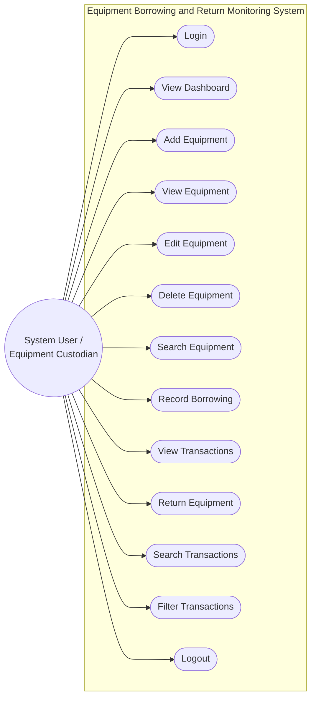

# Use Case Diagram & Specification

**System:** Equipment Borrowing and Return Monitoring System  
**Actor:** System User / Equipment Custodian  

---

## 1. Mermaid Use Case Diagram

---

## 2. Use Case Descriptions

| Use Case | Description | Primary Actor | Preconditions | Postconditions |
| :--- | :--- | :--- | :--- | :--- |
| **Login** | Authenticates custodian using email and password. | System Custodian | Valid user registered in Supabase Auth. | Session created, redirected to Dashboard. |
| **View Dashboard** | Displays dynamic summary counts (Total, Available, Borrowed, Returned, Overdue). | System Custodian | User is authenticated. | Live statistics displayed. |
| **Add Equipment** | Registers a new equipment item with unique asset code. | System Custodian | User is authenticated. | New equipment saved with `Available` status. |
| **View Equipment** | Lists laboratory equipment catalog in a responsive table. | System Custodian | User is authenticated. | Catalog records rendered. |
| **Edit Equipment** | Modifies equipment name, category, code, or condition. | System Custodian | Equipment record exists. | Record updated in Supabase. |
| **Delete Equipment** | Safely deletes equipment after confirmation. | System Custodian | Equipment not currently borrowed. | Equipment deleted from database. |
| **Search Equipment** | Filters equipment list by name or asset code in real-time. | System Custodian | Equipment catalog loaded. | Matching items displayed. |
| **Record Borrowing** | Creates borrowing transaction for an available item. | System Custodian | Equipment is `Available`. | Transaction created; item marked `Borrowed`. |
| **View Transactions** | Displays borrowing and return logs with details. | System Custodian | User is authenticated. | Transaction list rendered. |
| **Return Equipment** | Marks borrowed item as returned today and restores availability. | System Custodian | Transaction status is `Borrowed`. | Transaction status is `Returned`; item is `Available`. |
| **Search Transactions** | Searches logs by borrower, asset code, or item name. | System Custodian | Logs loaded. | Matching logs displayed. |
| **Filter Transactions** | Filters logs by Borrowed, Returned, or Overdue status. | System Custodian | Logs loaded. | Filtered subset displayed. |
| **Logout** | Ends custodian session securely. | System Custodian | User is logged in. | Session cleared, redirected to `login.html`. |
